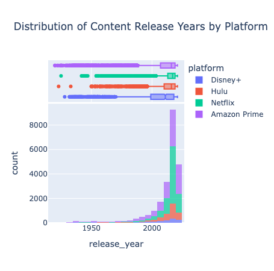
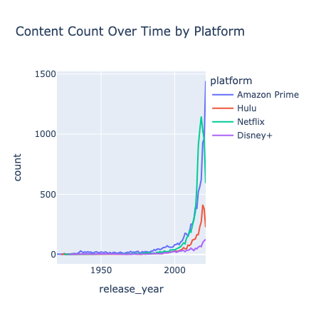
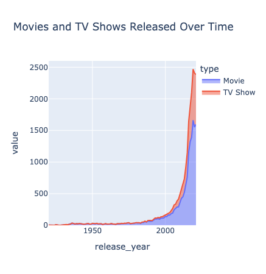
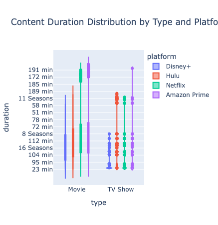
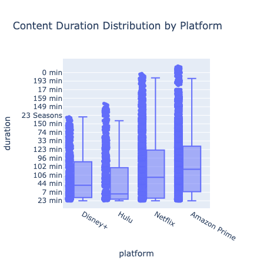
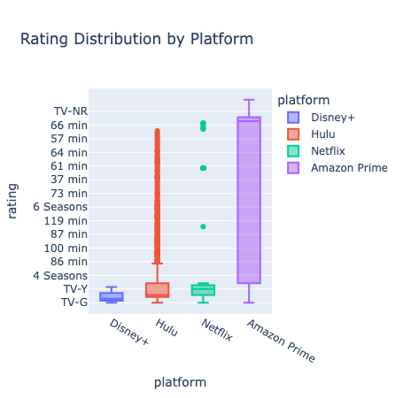
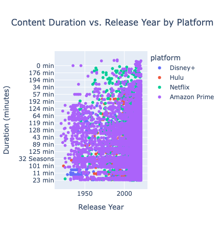
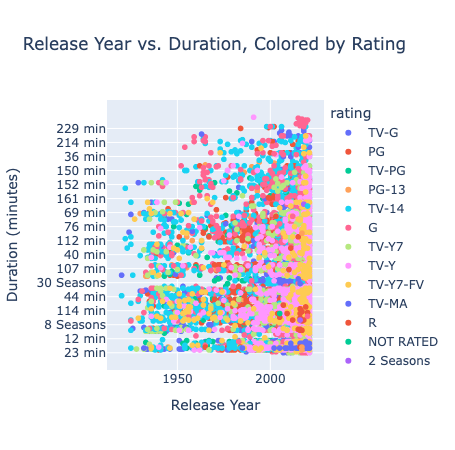

# **Streaming Services Analysis**

## *Analysis Overview:*

This analysis will dive into data from four leading streaming platforms—Netflix, Hulu, Amazon Prime, and Disney+—to explore trends, viewership patterns, and key performance metrics. By examining each service's unique offerings and subscriber behaviors, we aim to uncover insights that highlight their market positions and user preferences in the ever-evolving digital entertainment landscape.

## *Content Volume and Trends*

### Distribution of Content by Platform

{width="500"}

This visualization illustrates the proportion of the different platforms and their count of releases throughout the years. It appears that Amazon Prime has the highest count of releases for now, with Netflix close behind. 

### Content Count Over Time 

{width="500"}

This line graph tracks the growth in content offerings for each platform over time. We can see here that among the platforms Amazon Prime again has the highest release count through the years. Although, Disney+ seems to have remained steady with their releases over time. 

### Movies and TV Shows Released Over Time

{width="500"}

This visualization highlights the release patterns of movies and TV shows over time across all platforms. This graphic displays how much more prominent TV shows has become over the years with their value increasing more than Movies have. 

## *Content Duration Analysis*

### Duration of Content by Platform

{width="500"}

This plot provides a comparative analysis of the average content duration on each platform. We have Movie and TV shows being displayed, and it appears that Amazon Prime has the longest duration in both movies and tv shows, while Disney+ has the shortest. 

### Content Duration Boxplot

{width="500"}

This is another boxplot that examines the variation in content duration across all platforms, showing again how Amazon Prime dominates in terms of content duration with Netflix coming in second place. 

### Rating Distribution by Platform

{width="500"}

Here is one final boxplot offering a unique point of view displaying the distribution of ratings across the different platforms. It's interesting seeing the different shapes/sizes of each box plot. Amazon Prime seems to have the widest distribution of ratings compared to the rest. 

### Content Duration vs. Release Year

{width="500"}

This chart explores the relationship between content duration and release year. Something interesting worth noting is how dominant Amazon Prime seems to be in this graphic, which makes sense in terms of our other graphics. 

### Release Year vs Duration, colored by Rating

{width="500"}

Here is one additional scatter plot, showing us a more unique view of the relase year vs duration, with the rating being colored. The blue and pink seems to stand out the most among all the other colors, indicating that TV-14 and TV-Y are the most popular.  

## *Conclusion:*

The analysis reveals key differences in content strategies across the four platforms, with distinct trends in content offerings, duration, and release timing. We were able to see how dominant Amazon Prime and even Netflix were across the different platforms, displaying their popularity.